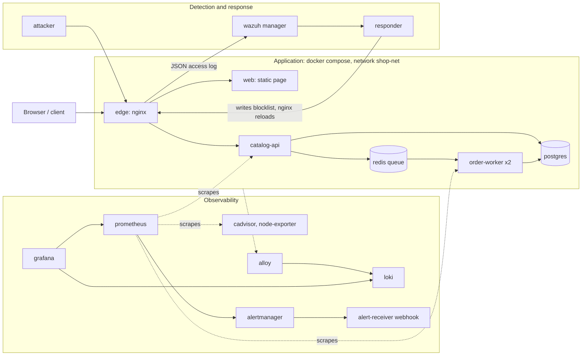
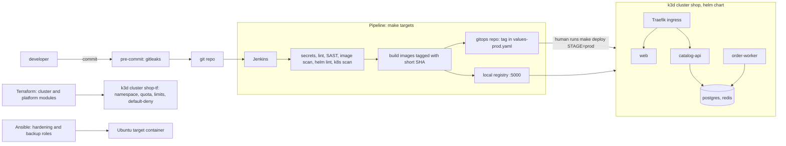

# Architecture

## Runtime

```mermaid
flowchart LR
  user["Browser / client"] --> edge["edge: nginx"]
  subgraph app["Application: docker compose, network shop-net"]
    edge --> web["web: static page"]
    edge --> api["catalog-api"]
    api --> pg[("postgres")]
    api --> redis[("redis queue")]
    redis --> worker["order-worker x2"]
    worker --> pg
  end
  subgraph obs["Observability"]
    prom["prometheus"] -. scrapes .-> api
    prom -. scrapes .-> worker
    prom -. scrapes .-> cadv["cadvisor, node-exporter"]
    alloy["alloy"] --> loki["loki"]
    graf["grafana"] --> prom
    graf --> loki
    prom --> am["alertmanager"]
    am --> recv["alert-receiver webhook"]
  end
  app -. container logs .-> alloy
  subgraph det["Detection and response"]
    edge -- "JSON access log" --> wazuh["wazuh manager"]
    wazuh --> resp["responder"]
    resp -- "writes blocklist, nginx reloads" --> edge
    attacker["attacker"] --> edge
  end
```

## Delivery and infrastructure

```mermaid
flowchart LR
  dev["developer"] -- commit --> hook["pre-commit: gitleaks"]
  hook --> repo["git repo"]
  repo --> jenkins["Jenkins"]
  subgraph pipe["Pipeline: make targets"]
    jenkins --> checks["secrets, lint, SAST, image scan, helm lint, k8s scan"]
    checks --> build["build images tagged with short SHA"]
    build --> reg["local registry :5000"]
    build --> gitops["gitops repo: tag in values-prod.yaml"]
  end
  gitops -- "human runs make deploy STAGE=prod" --> cluster
  reg --> cluster
  subgraph cluster["k3d cluster shop, helm chart"]
    traefik["Traefik ingress"] --> kweb["web"]
    traefik --> kapi["catalog-api"]
    kapi --> kdata[("postgres, redis")]
    kworker["order-worker"] --> kdata
  end
  tf["Terraform: cluster and platform modules"] --> tfc["k3d cluster shop-tf: namespace, quota, limits, default-deny"]
  ans["Ansible: hardening and backup roles"] --> target["Ubuntu target container"]
```
